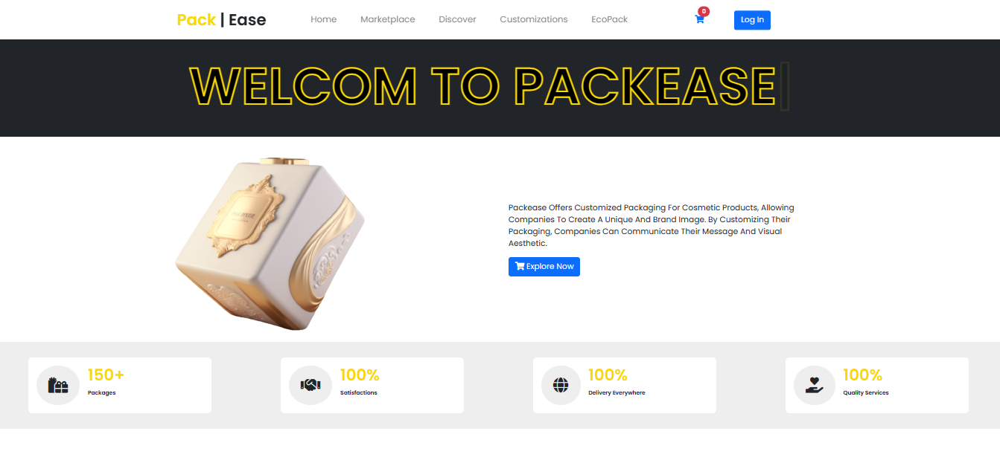
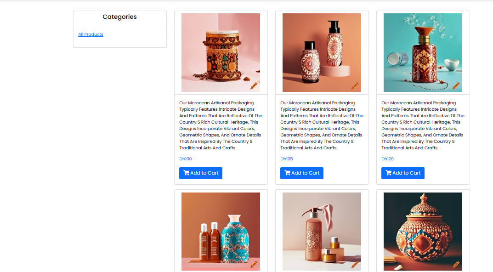
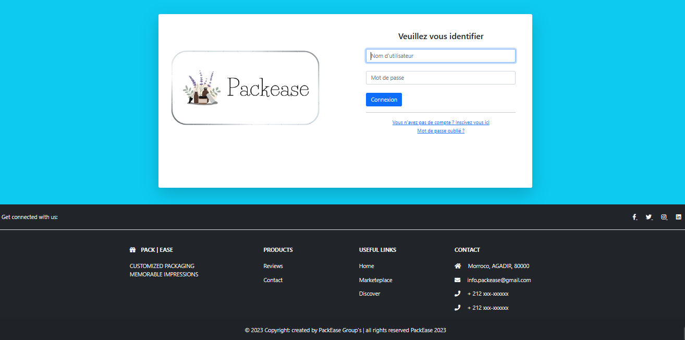
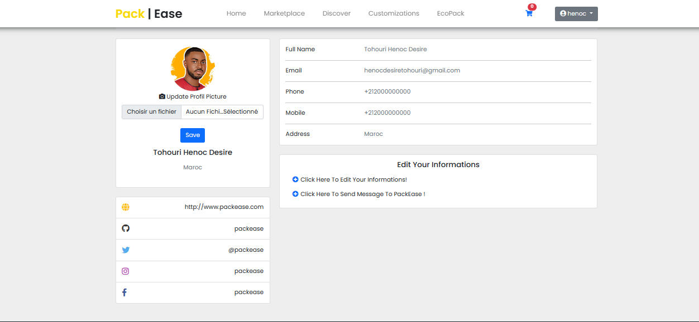
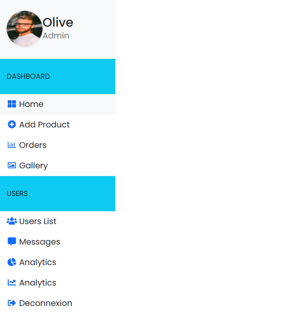

# PACKEASE_APP E-Commerce Application 

## What is PACKEASE_APP?
Packease is a E-commerce application for personalized packaging.

Packease is a web application based on CodeIgniter 4 that offers a platform for customized packaging. The aim of this application is to familiarize you with the basics of CRUD in CodeIgniter and to enable you to learn Bootstrap. Packease's main features include the ability for users to place orders, manage their account, view order history, edit personal information and add a profile photo. What's more, after placing an order, users will receive a confirmation e-mail containing their purchase total and the list of items ordered.

The application also features an administrator panel. Administrators can add new products to the platform, consult the list of registered users and view the list of orders.

## Packease's main features

### Authentication :
Users can register and log in to their account.
Users can retrieve and update their password if they forget it.

### User profile management:
Users can view and update their personal information.
Users can add a profile photo.

### Ordering:
Users can browse the products available in the marketplace.
Users can add items to their shopping cart.
Users can place an order with selected items.
Users receive an order confirmation e-mail with details of their purchase.
Users can view the history of their past orders.

### Administrator panel:
Administrators can log in to their account.
Administrators can add new products to the marketplace.
Administrators can view the list of registered users.
Administrators can view the list of past orders.

## Setup
Fork the project.
Clone it on your machine.
Copy `env` to `.env` and tailor for your app, specifically the baseURL ='http://localhost/packease_app/public/'
and add database settings.

## Project pictures

